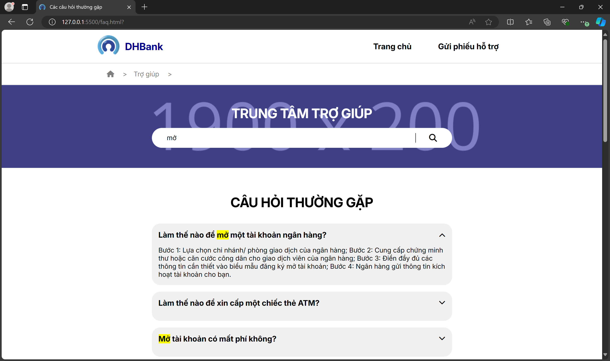

# DHBank - E-Banking Landing Page / A Front-end Website Design Project

    

A simple e-banking landing page, made with HTML, CSS, JS, and jQuery.
This is a website system designed for our Web Design class project.
(Disclaimer: The page is written entirely in Vietnamese.)

## Authors

* **Truong Van Dzung** - *Initial work* - [GitHub](https://github.com/dzungtvd)
* **Le Trieu Huy** - *Partner* - [GitHub](https://github.com/letrieuhuysabo/)

## Built With

* [Visual Studio Code](https://code.visualstudio.com/) - The web framework used

## Features

### Homepage

-   Image slider: Displays news and services for the page
-   News feed: Displays recent news articles
-- Allow users to read news articles within the page using a popup.
-   Services: Displays most common services.

### Services

- Detailed information about the services offered

### About Us
    
- Background and mission of the website

### Login Page

* *Disclaimer: A front-end placeholder, cannot login or register yet*
- Register/Login/Forgot password
- Image slider: Display services

### Support 

-   Frequently Asked Questions (FAQs)
-- Allows users to search for specific content
-   A form for sending supports & requests

### Recruiting

- Key factors for selecting *this* bank
- Allow users to search for specific job with name and location name
- A form to submit a job application.

### Others
 
- Scroll to Top button
- Responsive
- Vibrant and simple

## Demo

You can go to [link](https://dzungtvd.github.io/IT2302-TKWEB-C2/) to visit the live version of the website. 

## Acknowledgments

Big thanks to 
* **[LunDev](https://www.lundevweb.com/)** - [Image Slider - With Auto-play & Manual Navigation Buttons - Using CSS, HTML & Javascript](https://www.youtube.com/watch?v=VcRuVYYH3SE)
* **[Osvaldas Valutis](https://x.com/osvaldas)** - [Styling & Customizing File Inputs the Smart Way](https://tympanus.net/codrops/2015/09/15/styling-customizing-file-inputs-smart-way/)
* **[TechOverflow](https://techoverflow.net/)** - [Copying strings to the clipboard using pure Javascript](https://techoverflow.net/2018/03/30/copying-strings-to-the-clipboard-using-pure-javascript/)
* **[Freepik](https://www.freepik.com)** - [Website Logo](https://www.freepik.com/free-vector/blue-logo-branding-design-set_13312207.htm#fromView=search&page=1&position=28&uuid=83789265-f0d5-4612-8b1b-264313a25232)
* **[Google Fonts](https://fonts.google.com/)** - [Page Font (Inter)](https://fonts.google.com/specimen/Inter)
* **Canva Creative Studio** -  Images

## Screenshots
### Main Page

#### Services

#### News and Pop-up as Reader

#### Events

### About Us

### Login 

### FAQ

## Contributing

Contributions to the project are welcomed.
If you find any bugs, issues, or have suggestions for improvements, feel free to open an issue or submit a pull request.

## Thanks for reading and coming here! 
